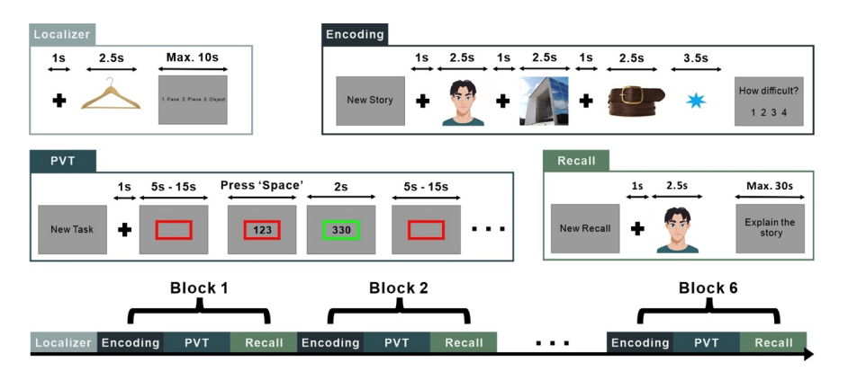

# Distinct encoding and post-encoding representational formats contribute to episodic sequence memory formation
Code of the paper Distinct encoding and post-encoding representational formats contribute to episodic sequence memory formation (2023, Xiongbo Wu)

## Abstract

In episodic encoding, an unfolding experience is rapidly transformed into a memory
representation that binds separate episodic elements into a memory form to be later
recollected. However, it is unclear how brain activity changes over time to
accommodate the encoding of incoming information. This study aimed to investigate
the dynamics of the representational format that contributed to memory formation of
sequential episodes. We combined Representational Similarity Analysis and
multivariate decoding approaches on EEG data to compare whether “category-level”
or “item-level” representations supported memory formation during the online
encoding of a picture triplet sequence and offline, in the period that immediately
followed encoding. The findings revealed a gradual integration of category-level
representation during the online encoding of the picture sequence and a rapid itembased neural reactivation of the encoded sequence at the episodic offset. However,
we found that only memory reinstatement at episodic offset was associated with
successful memory retrieval from long term memory. These results suggest that postencoding memory reinstatement is crucial for the rapid formation of unique memory
for episodes that unfold over time. Overall, the study sheds light on the dynamics of
representational format changes that take place during the formation of episodic
memories.

## Experiments

- Localisation task, 60 different images from 3
categories (face, place, and object) were presented. Participants were asked to indicate
the image category.

- The encoding phase consisted of an image of an object, a famous
face, and a famous place. Participants were asked to construct stories using the three
elements for a later memory test. A blue asterisk appeared at the end of each triplet and
participants rated their subjective sense of difficulty for story construction.

- For the Psychomotor vigilance task, participants were instructed to pay attention to the centre of
the screen, waiting to react at the onset of a text timer by pressing the 'Space' button. In
the recall phase, there were 12 recall trials, each of which used the first image of the
previously presented triplets to cue the free recall of the other two images. One block was
completed after the retrieval phase and the next block started following a brief break. The
experiment consisted of 6 blocks in total. An avatar image is displayed due to bioRxiv
policy on not displaying pictures of real people.

## Structure

- `/scripts`: Holds all MATLAB scripts necessary for performing the analyses.
  
  - `beh.m`: This script analyzes behavioral data from the study, likely processing and summarizing participant responses or performance metrics related to the episodic memory tasks.
  
  - `LDA_norm_enc.m`: Applies Linear Discriminant Analysis (LDA) to normalized EEG data during the encoding phase of the experiment to assess category-level or item-level representations.
  
  - `LDA_norm_loc.m`: Similar to `LDA_norm_enc.m`, but this script focuses on the localizer phase, potentially aiming to establish baseline or control comparisons for later analysis.
  
  - `LDA_norm_off.m`: Uses LDA on normalized data specifically during the episodic offset phase, focusing on the reactivation of memory traces and their role in successful retrieval.
  
  - `SIMI_encoff.m`: Computes similarity indices between encoding and offset representations, likely to investigate the continuity or change in neural representations post-encoding.
  
  - `SIMI_RSA_encenc.m`: This script is involved in Representational Similarity Analysis (RSA) during the encoding phase, comparing within-episode encoding dynamics.
  
  - `SIMI_RSA_shuffle.m`: Conducts RSA on shuffled data to examine the effects of disrupting temporal or categorical information on memory encoding and retrieval, serving as a control analysis.

## Usage

Each script is standalone and designed for specific analysis segments within the study. Ensure that all required data files are placed in their designated directories and MATLAB is configured with necessary toolboxes for EEG data analysis. For detailed instructions on parameters and execution, refer to comments at the start of each script file.

## Citation

> Wu, X., & Fuentemilla, L. (05 2023). Distinct encoding and post-encoding representational formats contribute to episodic sequence memory formation. Cerebral Cortex, 33(13), 8534–8545. doi:10.1093/cercor/bhad138
